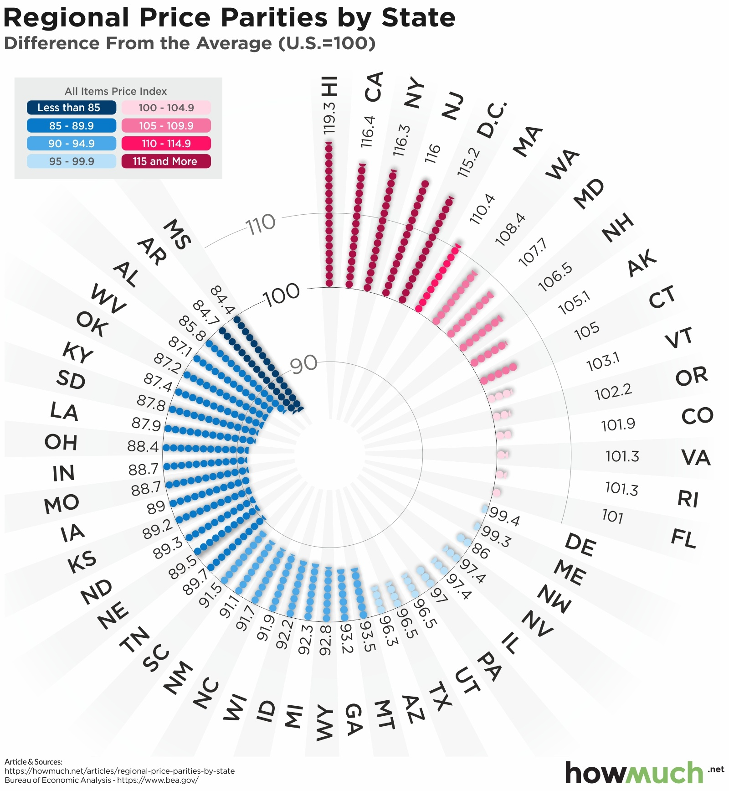
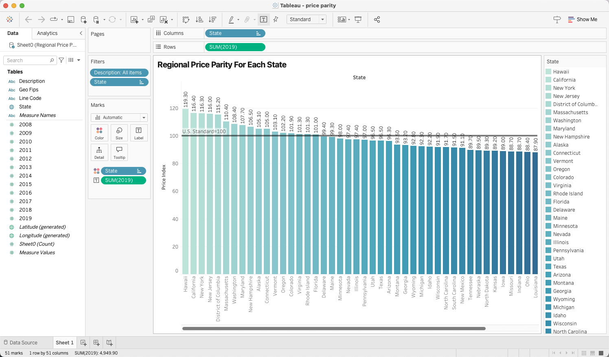

| [home page](https://ttony0.github.io/portfolio/) | [visualizing debt](visualizing-government-debt) | [critique by design](critique-by-design) | [final project I](final-project-1) | [final project II](final-project-2) |

# Assignment 3&4: Critique by Design

This assignment includes all the thoughts and insights as I go through the whole process of choosing a data viz and critiquing this data viz and then finally redesigning the data viz.

### Step one: choose a data visualization from MakeoverMonday

I choose this data viz from Year 2021 - Week 17 from [MakeoverMonday](https://makeovermonday.co.uk), which is created by *U.S. Bureau of Economic Analysis*. The original data viz is shown below:

*SOURCE ARTICLE: https://howmuch.net/articles/regional-price-parities-by-state*

*DATA SOURCE: https://apps.bea.gov/iTable/iTable.cfm?reqid=70&step=1&acrdn=8*

The reason why I choose this data viz is because this data viz is about regional price, which is a topic I am interested in. However, when I first saw this data viz, I was confused by the spinning design and spent some time to finally figure out what this data viz wanted to show, which is a great example to redesign.

### Step two: critique the data visualization

For critique, I followed the Stephen Few's Data Visualization Effectiveness Profile critique method, which critique data viz from the following dimensions:

- Informative
    - Usefulness
    - Completeness
    - Perceptibility
    - Truthfulness
    - Intuitiveness
- Emotive
    - Aesthetics
    - Engagement

After going through the critique method, I found this data visualization has both strengths and limitations. For strengths, this data visualization shows good data completeness and validity. The color (red vs blue) effectively distinguishes states above and below the U.S. standard price index. It also provides a complete representation of all states' price indices while maintaining data accuracy.

However, the way it presents the information has several limitations. The spinning circular design, though visually interesting, costs unnecessary effort for audiences to interpret the data. The bar length is not intuitive since it doesn't directly represent the price index values. The spinning design also makes this less intuitive. Additionally, the white and grey background provides no useful information, which is completely redundant. These design problems make the visualization less efficient to non-expert audiences.

Overall, this visualization seems more suited for economists and financial experts who are already familiar with price indices rather than general audiences. This data viz appears to more emphasize on Aesthetics and novelty. A simpler visualization format, such as just a simple bar chart, would likely be more effective in communicating this information to broader audiences.

### Step three: sketch out a solution

From the previous steps, I decided to redesign this data viz into a single bar chart and remove unnecessary design to make it clean and neat while convey necessary information.

Below is the first sketch I redesign:

To build this sketch, I put data into Tableau and filter data from Year 2019 under the Description: All itmes, which is the data chosen from the original viz. To convey the information more straightforward, I changed the original chart type into simple bar chart. The height of the bar chart represents the level of price index and I also put labels to each bar for audience to compare data easily. I also added a reference line to represent U.S. standard price index, which is 100, and changed the color to gold-blue.

### Step four: Test the solution

To test the first redesign, I found two people to share my sketch and asked what they saw from this picture. After that I introduced this data viz to them and asked what they thought was good in this data viz and what was bad. The followings are the records of their feedback:

1. student, man, mid 20's
    He is not familiar with Price Parity and Price index. What he can tell from the data viz is that this viz is about a price index and the standard index is 100. Some states are higher than standard and some states are lower than standard. Highest state is Hawaii and he can read all the price index from the viz. 

    After I explain what is price parity and its relationship to price index, here is his feedback:

    **What works:**

    Labels and reference line clearly indicate that some states have higher price index and some state have lower-than-standard price index, which is intuitive. The bold title also catch audience's attention and set up first impression about this viz. Additionally, using bar chart intuitively demonstrate levels of price index.

    **What doesn't work:**

    The gold-blue diverging color doesn't give strong impression to the audiences about the difference of high-price-index state and low-price-index state. Full name for state adds difficulty on reading the viz. Regional in the title is redundant.

2. student, woman, mid 20's
    Below is her feedback:

    **What works:**

    Labels and reference line is intuitive.

    **What doesn't work:**

    Label of x-axis should be close to x-axis to indicate that x-axis is state name. Description of U.S. standard line can be added at the bottom of the viz to help understand the reference line.

    **Inspiration:**

    The viz can be changed as: use reference line as x-axis and only shows the difference between standard line and state's price index.

### Step five: Build your solution

According to their feedback, I have adjust my data viz. I add a abbreviation variable to Tableau for state abbreviation. Also I changed the color to orange-blue diverging. In order to emphasize the difference to the U.S. average price index, I added second viz at the bottom of the viz, which has corresponding x-axis and put difference here. I also adjusted my title and added caption to cite data and described what is U.S. average.

Below is the final solution:

  <noscript>
    
  </noscript>
  <object class='tableauViz' style='display:none;'>
    <param name='host_url' value='https%3A%2F%2Fpublic.tableau.com%2F' />
    <param name='embed_code_version' value='3' />
    <param name='site_root' value='' />
    <param name='name' value='priceparity_17315559335450/Sheet1' />
    <param name='tabs' value='no' />
    <param name='toolbar' value='yes' />
    <param name='static_image' value='https://public.tableau.com/static/images/pr/priceparity_17315559335450/Sheet1/1.png' />
    <param name='animate_transition' value='yes' />
    <param name='display_static_image' value='yes' />
    <param name='display_spinner' value='yes' />
    <param name='display_overlay' value='yes' />
    <param name='display_count' value='yes' />
    <param name='language' value='en-US' />
    <param name='filter' value='publish=yes' />
  </object>

