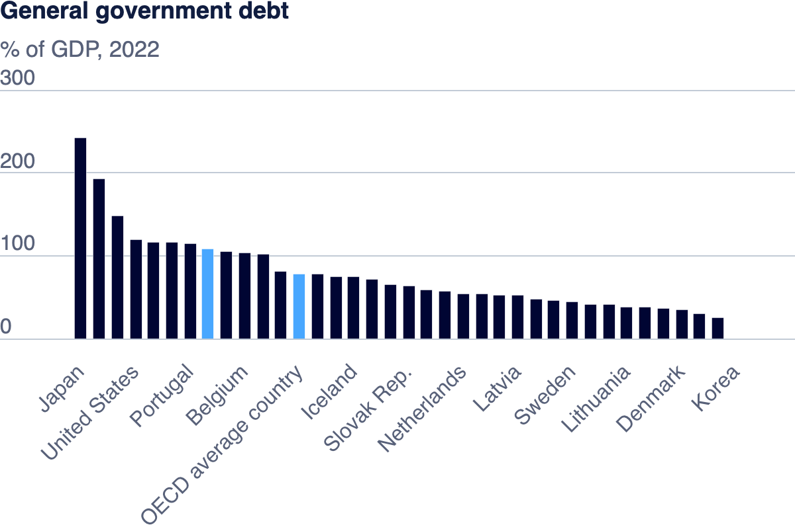

| [home page](https://ttony0.github.io/portfolio/) | [visualizing debt](visualizing-government-debt) | [critique by design](critique-by-design) | [final project I](final-project-1) | [final project II](final-project-2) |

# Assignment: Visualizing overnment Debt

## Part 1 Government debt bar chart

## Part 2 debt-to-GDP hightlight table

  <noscript>
    
  </noscript>
  <object class='tableauViz' style='display:none;'>
    <param name='host_url' value='https%3A%2F%2Fpublic.tableau.com%2F' />
    <param name='embed_code_version' value='3' />
    <param name='site_root' value='' />
    <param name='name' value='debt-to-GDP&#47;debt-to-GDP' />
    <param name='tabs' value='no' />
    <param name='toolbar' value='yes' />
    <param name='static_image' value='https:&#47;&#47;public.tableau.com&#47;static&#47;images&#47;de&#47;debt-to-GDP&#47;debt-to-GDP&#47;1.png' />
    <param name='animate_transition' value='yes' />
    <param name='display_static_image' value='yes' />
    <param name='display_spinner' value='yes' />
    <param name='display_overlay' value='yes' />
    <param name='display_count' value='yes' />
    <param name='language' value='en-US' />
    <param name='filter' value='publish=yes' />
  </object>

## Part 3 Average debt-to-GDP ratio comparison over Year

  <noscript>
    
  </noscript>
  <object class='tableauViz' style='display:none;'>
    <param name='host_url' value='https%3A%2F%2Fpublic.tableau.com%2F' />
    <param name='embed_code_version' value='3' />
    <param name='site_root' value='' />
    <param name='name' value='BoxPlot_17307645337270&#47;BoxPlot' />
    <param name='tabs' value='no' />
    <param name='toolbar' value='yes' />
    <param name='static_image' value='https:&#47;&#47;public.tableau.com&#47;static&#47;images&#47;Bo&#47;BoxPlot_17307645337270&#47;BoxPlot&#47;1.png' />
    <param name='animate_transition' value='yes' />
    <param name='display_static_image' value='yes' />
    <param name='display_spinner' value='yes' />
    <param name='display_overlay' value='yes' />
    <param name='display_count' value='yes' />
    <param name='language' value='en-US' />
    <param name='filter' value='publish=yes' />
  </object>

## Part 4 Summary

#### Why I choose the third data visualization

I choose a box plot to visualize the dataset because I want to evaluate the average debt to GDP ratio for all the countries mentioned in the dataset. Meanwhile, I want to know if there is some outliner countries, that's why I choose box plot. It can demonstrates the average debt to GDP ratio of all the countries while hightlight outliners. In this way I can have a comprehensive understanding of how this ratio has changed over this period and which country has abnormal debt to GDP ratio.

#### Comparison of all data visualizations

After going through all these three data visualizations, I found that there are no pros and cons for different data visualizations - it all depends on what story you want to tell and choose the right method to visualize data. In the second data visualization, what we want to emphasize is the ratio number itself. That's why we use heat map - we can use different color on the heat map to intuitively demonstrates the level of the number. In the third data visualization, I want to tell a story of average ratio level and whether there are outliners, so I choose box plot. We just need to know whether a data visualization method is fit for the data you want to demonstrates to your audience when making a data visualization. Then we can work on color and other description to enhance the effect of our data visualization.
